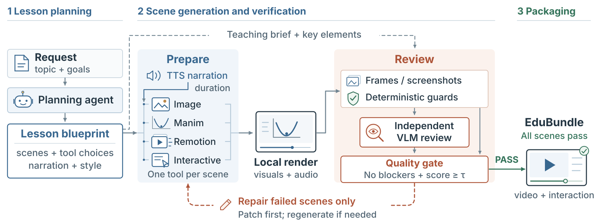

# EduCAST

EduCAST is the web interface for EduHarness: teaching requests become narrated
lessons with animations, illustrations, chapter navigation, and interactive practice.

This repository contains the existing website, its Python backend, lesson-generation
pipeline, Remotion template, fonts, character artwork, and tests. Generated course
bundles, local API credentials, execution logs, and development artifacts are excluded.

## Run the website

Use Python 3.10 or later. From the repository root:

```bash
python -m venv .venv
source .venv/bin/activate
python -m pip install -r requirements.txt
python -m eduharness.studio.public --host 127.0.0.1 --port 8091
```

Open `http://127.0.0.1:8091/` for the homepage and
`http://127.0.0.1:8091/new-lesson` for the lesson form.
The public application requires a Python server; GitHub Pages alone cannot run
the generation API or local renderers.

The homepage's featured players reference pre-generated bundles under
`runs/quadratics/bundle`, `runs/lever_v2_backup/bundle`, and `runs/ohms_law/bundle`.
The additional examples reference `runs/binary/bundle` and
`runs/photosynthesis/bundle`. Those media files are not part of this source export.
Until the corresponding bundles are copied or generated, their players will be
unavailable. The rest of the interface and the New lesson form remain accessible.

## Enable lesson generation

Generation additionally requires FFmpeg, a local Manim installation, a Playwright
browser, and the pinned Remotion dependencies. On Debian/Ubuntu:

```bash
sudo apt-get install ffmpeg build-essential python3-dev pkg-config \
  libcairo2-dev libpango1.0-dev fonts-liberation
python -m pip install -r requirements-render.txt
python -m playwright install --with-deps chromium
cd remotion_template
npm ci
cd ..
```

Use Node.js 18 or later for the template. A LaTeX installation is optional for
Manim MathTex; without it, some explanations use plain text. Restart the Python
server from the environment containing the installed rendering tools.

The default model names are recorded in `.env.example`; users need API access
and quota for the selected models. No credentials are bundled with this repository.

## Bring your own OpenAI API key

The New lesson form accepts an OpenAI API key with the lesson request. Public
creation and retry requests require a key and do not fall back to the server's key.
The backend passes it through the job's child-process environment to the official
`https://api.openai.com/v1` endpoint for text, vision, images, and narration.

The credential is removed before writing the lesson request and is not placed in
the command line, job metadata, or browser localStorage. The form clears it after
a successful submission; retries require re-entry. This is server-mediated use:
the hosting server receives the key for the job. Use HTTPS outside localhost and
do not enable request-body/header logging for credential-bearing requests.

Endpoints:

- `GET /api/lessons/config`: form defaults and local rendering capabilities.
- `POST /api/lessons`: lesson fields plus `openai_api_key`; supports `Idempotency-Key`.
- `GET /api/lessons/{id}`: saved progress.
- `POST /api/lessons/{id}/retry`: `openai_api_key` for retrying a saved lesson.

This demo does not implement user accounts or private ownership of generated
bundles. Keep it on localhost or behind appropriate access controls when handling
private lesson content. The separate local Studio exposes job controls and logs:

```bash
python -m eduharness.studio --runs-dir runs --port 8080
```

## Source map

| Location | Purpose |
| --- | --- |
| `eduharness/studio/index.html` | Homepage and Studio markup |
| `eduharness/studio/app.css`, `landing.js` | Visual design and homepage interactions |
| `eduharness/studio/assets/new-lesson.*` | New lesson form |
| `eduharness/studio/assets/more-lessons.*` | Additional examples |
| `eduharness/studio/public.py` | Public routes and lesson API |
| `eduharness/studio/server.py` | Local Studio and background jobs |
| `eduharness/pipeline.py`, `stage1/`, `stage2/` | Planning, preparation, rendering, review, repair |
| `eduharness/stage3/` | EduBundle packaging and player |
| `remotion_template/` | Motion-graphics renderer |



## Tests

```bash
python -m pip install -r requirements-dev.txt
python -m pytest -q tests/test_studio.py tests/test_user_api_key.py tests/test_config.py
```

Browser tests additionally require Playwright and Chromium. Unit tests use
simulated providers or subprocesses; they do not require a real API key.

Bundled font license notices are retained alongside their font files.
